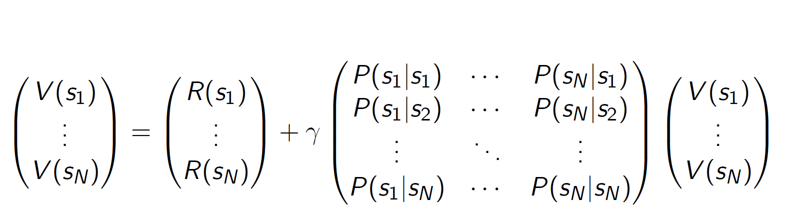

# Sequential decision making under uncertainty

## Markov Decision Process (MDP)
Markov Decision Process (MDP) is a very popular assumption in RL, probably because it is simple and can be satisfied if include some history as part of the state, and in practice the markov assumption can reduce the complexity of computation and demands on data.

Types of Sequential Decision Making:
- is state Markov? is world partially observable?
- are dynamics deterministic or stochastic?
- do actions influence only immediate rewards or reward and next state?

### MRP

`MRP` (Markov Reward Process) is Markov Chain with rewards:
- States: $S$
- Transition model: $P(s' | s, a)$
- Reward function: $R(s) = E[R_{t+1} | S_t = s]$
- Discount factor: $\gamma \in [0, 1]$

`Horizon` means the number of steps in each episode, it can be finite or infinite.
`Return`: $G_t = R_{t} + \gamma R_{t+1} + \gamma^2 R_{t+2} + ... = \sum_{k=0}^{\infty} \gamma^k R_{t+k+1}$
`Value function`: $v(s) = E[G_t | S_t = s]$, that is, expected return from starting in state s.

Discount factor $\gamma$ can determine how much we care about future rewards. If $\gamma = 0$, we only care about immediate rewards, if $\gamma = 1$, we care about all future rewards equally.

For finite state MRP, matrix can be used to represent the system:

### MDP

`MDP` (Markov Decision Process) is MRP + actions:
- Markov State: $S$
- actions: $A$
- Transition model: $P(s' | s, a)$
- Reward function: $R(s, a) = E[R_{t+1} | S_t = s, A_t = a]$
- Discount factor: $\gamma \in [0, 1]$

That's to say, MDP is a tuple $(S, A, P, R, \gamma)$.

### Markov Reward Process

Policy $\pi$ specifies what action to take in each state, which can be deterministic or stochastic. Basically, policy can be defined as $\pi(a|s) = P[A_t = a | S_t = s]$.

`Markov Reward Process` is actually MDP + $\pi(a|s)$.
More precisely, MRP is a tuple $(S, R^{\pi}, P^{\pi}, \gamma)$, where $R^{\pi}(s) = \sum_{a \in A} \pi(a|s) R(s, a)$ and $P^{\pi}(s' | s) = \sum_{a \in A} \pi(a|s) P(s' | s, a)$.

Based on the  equation, we can further retrive the long-term value by iterating martix multiplication until convergence:
$$v^{\pi}_k(s) = \sum_{a \in A} \[ R(s, a) + \gamma \sum_{s' \in S} P(s' | s, a) v^{\pi}_{k-1}(s') \]$$. This is called `Bellman backup`.

## Policy Iteration

Basically, `PI` is how we find optimal policy in MDP, which mainly consists of alternating policy **evaluation** and policy **improvement**.

Q-value: $q^{\pi}(s, a) = R(s, a) + \gamma \sum_{s' \in S} P(s' | s, a) v^{\pi}(s')$ is used to evaluate the value of taking action $a$ in state $s$ under policy $\pi$, where $v^{\pi}(s) = \sum_{a \in A} \pi(a|s) q^{\pi}(s, a)$, meaning the expected return from starting in state $s$ and following policy $\pi$.

And PI can guarantee a monotonically improving policy sequence, since the new policy is always at least as good as the old policy.

## Value Iteration

`VI` is another way to find optimal policy in MDP, which wants to maintain the optimal value of starting in each state if have a finite horizon.

Let $BV(s) = \max_{a \in A} \[ R(s, a) + \gamma \sum_{s' \in S} P(s' | s, a) v(s') \]$, then we can update the value function by $V_{k+1}(s) = BV(s)$.
