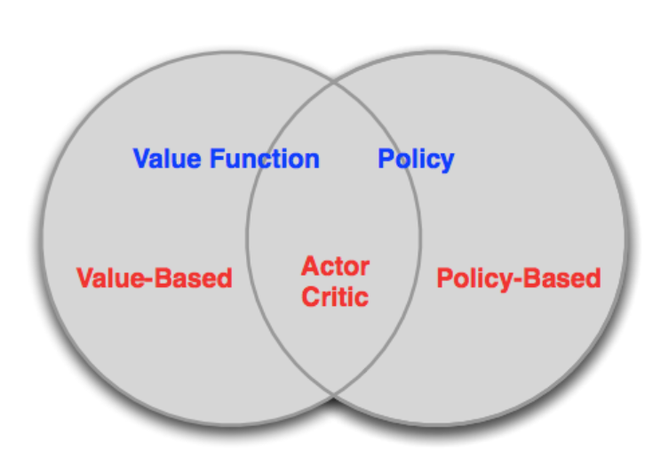

# Policy Gradient

## Classification of RL algorithms


typically, there are 3 types of RL algorithms:
1. **Value-based**: learn a value function that tells us how good it is to be in a particular state, like Q-learning, DQN. In these algorithms, policy is kind of **implicit**, like $\epsilon$-greedy.

2. **Policy-based**: learn a policy that tells us what action to take, like REINFORCE, PPO. In these algorithms, there is no value function.

3. **Actor-critic**: learn both value function and policy, like A2C, A3C. 

In some cases, deterministic policy is not suitable, and value-based methods always learn near-deterministic policies. 
Henec, policy-based methods are more flexible and can learn stochastic policies.

## Introduction

The Goal of Policy-Based RL is:
given a policy $\pi_{\theta}(s,a)$ with parameters $\theta$, we want to find the best parameters $\theta^*$.
In episodic tasks, we can define "best" as the policy that maximizes the policy value at the start state $V(s_0, \pi_{\theta})$.

Hence, policy-based methods is actually an **optimization** problem, where we want to maximize $V(s_0, \pi_{\theta})$ with respect to $\theta$.
And we can use **gradient free optimization** methods, like hill climbing, genetic algorithms, etc.

However, **gradient-based** methods are more efficient and widely used:
- gradient descent
- conjugate gradient
- quasi-Newton methods

In summary, policy-based methods have the following advantages:
- better convergence properties
- effective in high-dimensional or continuous action spaces
- can learn stochastic policies

Nevertheless, policy-based methods also have some disadvantages:
- typically converge to a local rather than global optimum
- evaluating a policy is typically inefficient and has high variance

### Value of Parametrized Policy

Policy value is defined as: $V(s_0, \pi_{\theta}) = E_{\pi_{\theta}}[\sum_{t=0}^T R(s_t, a_t); \pi_{\theta}, s_0]$, where $R(s_t, a_t)$ is the reward at time $t$.

And the value can be re-expressed in 2 ways:
- $V(s_0, \pi_{\theta}) = \sum_{a} \pi_{\theta}(a|s_0) Q(s_0, a,\theta)$  

- $V(s_0, \pi_{\theta}) = \sum_{\tau} P(\tau; \theta) R(\tau)$, where $\tau$ is a state-action trajectory: $\tau = (s_0, a_0, s_1, a_1, ..., s_T, a_T)$; $P(\tau; \theta)$ is used to denote the probability of trajectory $\tau$ under policy $\pi_{\theta}$ with start state $s_0$.

And the second expression is more useful in practice, which is called ** likelihood ratio**.

## Likelihood Ratio Policy

Based on above expression, now the goal can be defined as: 
$$argmax_{\theta} V(\theta) = argmax_{\theta} \sum_{\tau} P(\tau; \theta) R(\tau)$$

and we can define the **policy gradient** with **likelihood ratio** as:
$$\nabla_{\theta} V(\theta) = \sum_{\tau} P(\tau; \theta) R(\tau) \nabla_{\theta} log P(\tau; \theta)$$

where $P(\tau; \theta)$ is the probability of trajectory $\tau$ under policy $\pi_{\theta}$ with start state $s_0$.

However, the above expression is still hard to compute, since it involves the sum over all possible trajectories.
SO, we can use sampling to estimate the gradient:
$$\nabla_{\theta} V(\theta) \approx \frac{1}{N} \sum_{i=1}^N R(\tau_i) \nabla_{\theta} log P(\tau_i; \theta)$$

where $\tau_i$ is a sampled trajectory.

Furtermore, $\nabla_{\theta} log P(\tau_i; \theta)$ can be re-expressed as:
$$\sum_{t=0}^{T-1} \nabla_{\theta} log \pi_{\theta}(a_t|s_t)$$
where no model is needed and only score function is used, which is powerful and general.

Then we get the definition of **score function**:
$$\nabla_{\theta} log \pi_{s;\theta} $$

### Score Function Gradient Estimator

A general form of score function gradient estimator is:
$$\hat{g} = f(x_i) \nabla_{\theta} log \pi_{\theta}(x_i)$$
where $f(x_i)$ is the return of trajectory $x_i$.

The intuition behind this estimator is that we want to increase the probability of good trajectories in proportion to their return.


## Policy Gradient Algorithms

Typical likelihood ratio policy gradient is unbiased, but has high variance, the introduction of **temporal structure** or **baseline** can reduce the variance.

### REINFORCE

The REINFORCE algorithm is a simple policy gradient algorithm that uses a Monte Carlo estimate of the return.

The basic idea is:

```
for each episode {$s_0, a_0, r_1, ..., s_T$} ~ $\pi_{\theta}$ do:
    for t = 1 to T do:
        $\theta = \theta + \alpha \nabla_{\theta} log \pi_{\theta}(a_t|s_t) R_t$
return $\theta$
```

The essence of REINFORCE is to use temporal structure to reduce variance, where $R_t$ is the return at time $t$.

### Baseline

However, the above algorithm still has high variance, and the introduction of **baseline** can reduce the variance:
$$\nabla_{\theta} V(\theta) = \sum_{\tau} P(\tau; \theta) (R(\tau) - b) \nabla_{\theta} log P(\tau; \theta)$$

where $b$ is the baseline, which is independent of the action.

Common choice of baseline is the value function $V(s)$, which is independent of the action.

## Actor-Critic Methods

As mentioned before, only using policy gradient methods although are unbiased, but have high variance, except for the introduction of baseline, we can also use **critic** to estimate the value function.

Actor-critic methods are a combination of policy-based and value-based methods, where the **actor** is the policy and the **critic** is the value function.

### N-step estimator

N-step estimator is actually a mixture of Monte Carlo and TD learning, where the return is estimated by N-step return:

$$R_t^{(N)} = r_t + \gamma r_{t+1} + ... + \gamma^{N-1} r_{t+N-1} + \gamma^N V(s_{t+N})$$

when N=1, it is TD(0), and when N=$\infty$, it is Monte Carlo.

And if substract baseline from the return, we get the advantage estimator:
$$A_t^{(N)} = R_t^{(N)} - V(s_t)$$


## Problems with Policy Gradient

The key limitation of policy gradient methods is that:
1. sample efficiency: policy gradient methods need a large number of samples to estimate the gradient accurately.
2. Distances in parameter space do not correspond to distances in policy space: little change in the parameters can lead to a large change in the policy.

### Inefficient Exploration
The core reason is that the policy gradient is a on-policy method, which means that the samples are collected under the current policy and only can be used once.

Considering use the samples more than once, and use new policy to sample more samples, then it is much more efficient.
However, there are some challenges: how many times can old samples be used?
That is, we need to find a just right balance between sample efficiency and bias.

### Step Size Exploration

The key issue of dismatch between parameter space and policy space is that the step size is hard to choose.
If the step size is too large, the policy can change too much and even skip the optimal policy; if the step size is too small, the convergence can be slow.

Furthermore, we can only control the step size in parameter space, which is still some kind of mismatch with policy space.

In summary, we want to find a way update the policy that is able to:
1. use rollouts collected from the most recent policy as efficiently as possible
2. take steps in policy space instead of parameter space

## Policy Performance Bounds

To improve the sample efficiency, we can use the **policy performance bounds** to guide the policy update.
The key idea in policy performance bounds is **performance difference lemma**:
$$ J(\pi') - J(\pi) = E_{\tau \sim \pi'}[\sum_{t=0}^T \gamma^t A^{\pi} (s_t, a_t)]$$

This lemma gives us a way to estimate the performance of a new policy $\pi'$ based on the trajectory collected under the old policy $\pi$, instead of needing to collect new trajectories.

If the KL divergence between the old and new policy is small, then we can use **importance sampling** to estimate the performance difference.

KL divergence is a measure of how much one probability distribution differs from a second, which can also be used in PPO algorithm to control the step size.